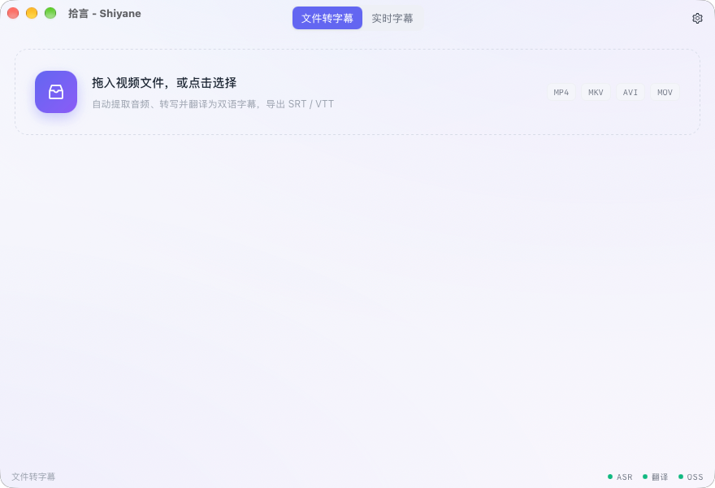
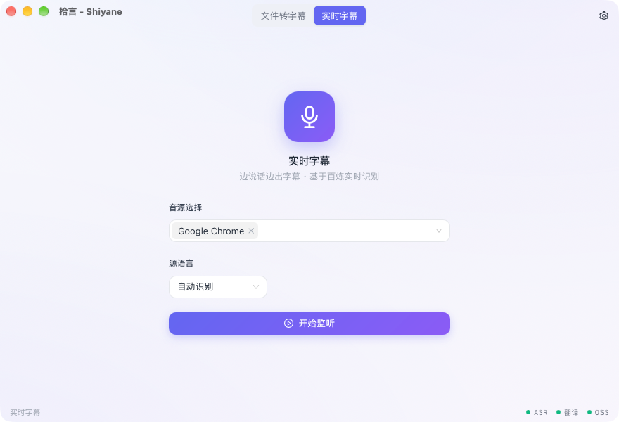
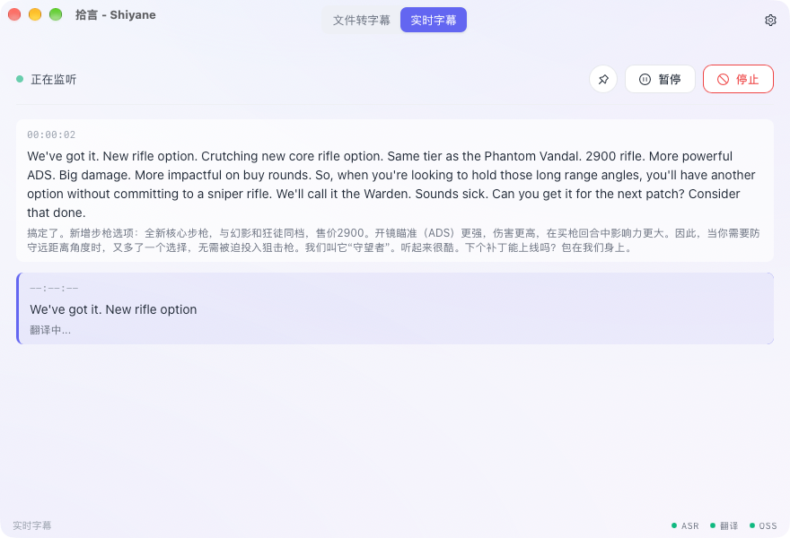
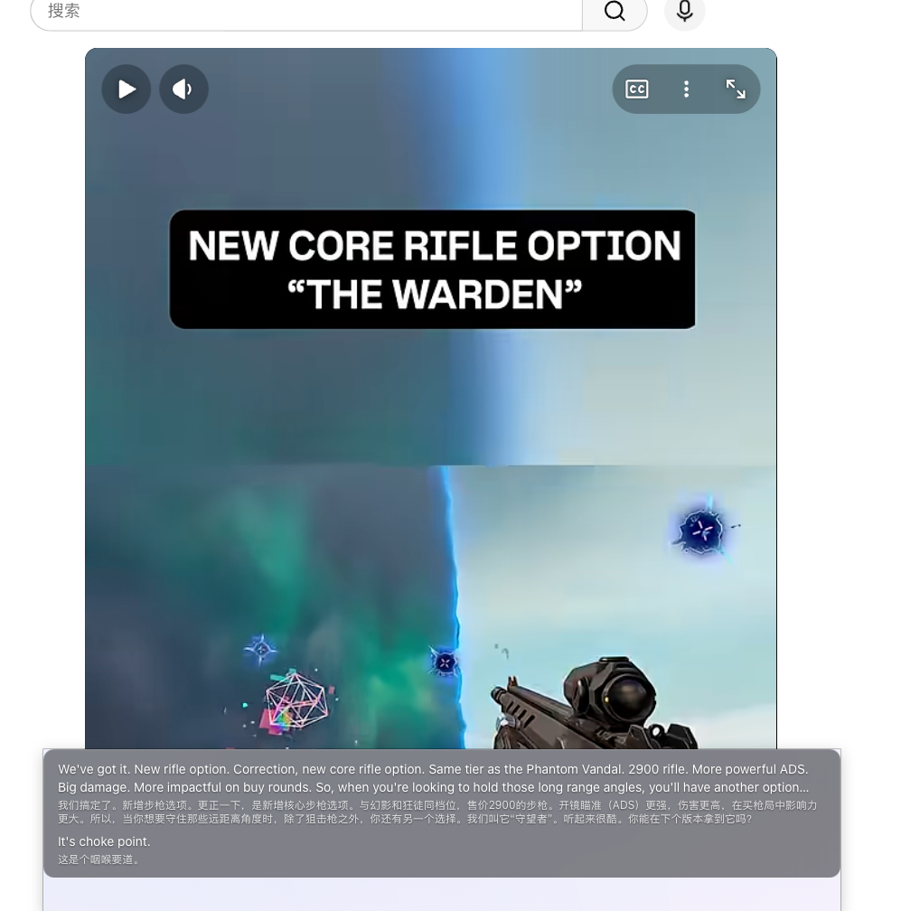

# Shiyane (拾言)

Video-to-bilingual-subtitle tool + realtime subtitles. Drop a video to export SRT/VTT, or listen to system audio/microphone for live subtitles.

[中文文档](README.md)

## Screenshots

**File to subtitles**



**Realtime · audio source**



**Realtime · source + translation**



**Floating overlay · always on top**



## How it works

1. **Drop a video file** (mp4, mkv, avi, mov, ...)
2. **Pick the source language** (or auto-detect)
3. **Audio is extracted** locally via ffmpeg
4. **Speech recognition** — the audio is uploaded to your own OSS bucket and transcribed by [Alibaba Cloud Bailian](https://bailian.console.aliyun.com/) `qwen-audio-3.0-asr-flash-filetrans` (async task; up to 3 hours per video, 5GB extracted audio)
5. **Translation** — each sentence is translated via any OpenAI-compatible API (OpenAI, DashScope, DeepSeek, Kimi, ...)
6. **Export** — SRT or VTT with both source and translated text

## Features

- **File-to-subtitle pipeline** — drag & drop or file picker, live progress with per-sentence granularity, clear success/failure states with error messages
- **Realtime subtitles** — capture system audio (per-process selectable) or microphone, live source text + translation; pause/resume/stop
- **Floating subtitle overlay** — always-on-top lyric-bar window for watching videos or meetings without switching apps; adjustable background opacity
- **Resume & task control** — per-sentence progress is persisted; after a crash or restart, tasks resume from where they stopped (no re-upload or re-transcription). Pause anytime; stop resets the task
- **Recent tasks** — the home screen lists recently processed videos with their status; resume unfinished tasks or delete them
- **Real connectivity tests** — validate ASR / translate / OSS settings before saving
- **BYOK** — API keys are encrypted locally (AES-256-GCM + Argon2), only ever sent to the respective API
- **Private-by-default audio handling** — audio is uploaded to your own OSS bucket via signed URLs and deleted once transcription finishes
- **Separate file/realtime ASR models** — `qwen-audio-3.0-asr-flash-filetrans` for file transcription, `qwen-audio-3.0-asr-flash-streaming` for realtime recognition
- **Cross-platform** — macOS, Windows, Linux (Tauri 2.0)

## Prerequisites

Users who install the release build need nothing else — the macOS bundle ships with
ffmpeg/ffprobe included. You only need:

- A [Bailian](https://bailian.console.aliyun.com/) API key (Beijing region)
- An Alibaba Cloud [OSS](https://oss.console.aliyun.com/) bucket (private is fine) with a RAM AccessKey that can read/write it

When building from source without bundling the binaries (see below), install ffmpeg yourself:

- macOS: `brew install ffmpeg`
- Ubuntu: `sudo apt install ffmpeg`
- Windows: download from https://ffmpeg.org/download.html

## Build from source

```bash
# Install Rust (2024 edition)
curl --proto '=https' --tlsv1.2 -sSf https://sh.rustup.rs | sh

# Install Tauri CLI and Node.js (>= 20)
cargo install tauri-cli

# Clone and build
git clone https://github.com/usongon/shiyane.git
cd shiyane
./scripts/build-ffmpeg.sh   # optional: produce the bundled ffmpeg/ffprobe (macOS arm64, LGPL)
cargo tauri build           # installs frontend deps in src-ui/ and builds it automatically
```

Building without running `build-ffmpeg.sh` also works — the app then falls back to an
ffmpeg found on the system PATH.

The built app is in `target/release/bundle/`. Third-party licenses: [THIRD_PARTY_NOTICES.md](THIRD_PARTY_NOTICES.md).

## Development

```bash
cargo tauri dev    # Vite dev server (5173) + Rust incremental build + HMR
```

You can also run the frontend alone in a browser (demo mode with mock data, no keys required):

```bash
cd src-ui && npm install && npm run dev
```

## Configuration

Open the **Settings** tab:

| Field | Description |
|-------|-------------|
| **File transcription model** | Default `qwen-audio-3.0-asr-flash-filetrans` |
| **Realtime model** | Default `qwen-audio-3.0-asr-flash-streaming` (for realtime subtitles) |
| **ASR API Key** | Bailian API key |
| **Workspace ID** | Bailian workspace ID (required for Beijing region; console top-right) |
| **Translate Provider** | OpenAI / DashScope / DeepSeek / Kimi |
| **Translate Model** | Auto-filled per provider, editable |
| **Translate API Key** | Translation API key |
| **Target Language** | zh / en / ja / ko |
| **OSS Endpoint** | e.g. `oss-cn-hangzhou.aliyuncs.com` |
| **OSS Bucket / AK ID / AK Secret** | Your bucket and credentials |
| **OSS Path Prefix** | Optional, e.g. `shiyane-temp/` |

API keys are stored encrypted at `~/Library/Application Support/pick-up-sound-text/config.json` (0600 permissions).

## Architecture

```
src/               # Rust backend
├── asr/          # FileAsrProvider (async transcription) + DashScope realtime WebSocket client
├── audio/        # AudioSource trait + FileAudioSource (ffmpeg) + CaptureSource (ScreenCaptureKit / cpal)
├── oss/          # OSS uploader with HMAC-SHA1 signed URLs
├── translate/    # TranslateProvider trait + OpenAI-compatible HTTP client
├── pipeline/     # FilePipeline + RealtimePipeline (capture → ASR → translate, three concurrent tasks)
├── checkpoint/   # resume: append-only progress log
├── subtitle/     # SubtitleEntry, SRT/VTT generation
├── config/       # AppConfig + encrypted keystore
└── commands/     # Tauri commands (frontend ↔ backend)

src-ui/            # Frontend (React + TypeScript)
├── src/lib/      # Tauri backend bridge + browser mock demo layer
├── src/views/    # File / Realtime / Overlay / Settings views
└── src/theme.ts  # AntD theme (light/dark, brand tokens)
```

## Tech stack

- **Backend**: Rust 2024, Tauri 2.0, tokio, reqwest, tokio-tungstenite
- **Frontend**: React 18 + TypeScript + Ant Design 5 + Vite (light/dark themes)
- **ASR**: Bailian async file transcription API (submit → poll → download) + realtime WebSocket streaming
- **Translation**: OpenAI-compatible Chat Completions API
- **Audio**: ffmpeg (file extraction), ScreenCaptureKit + cpal (realtime capture), rubato (resampling)

## License

[FSL-1.1-ALv2](LICENSE) — free for non-commercial use; commercial use requires a license. Converts to Apache 2.0 two years after release.
